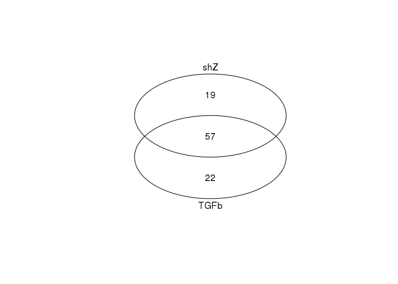
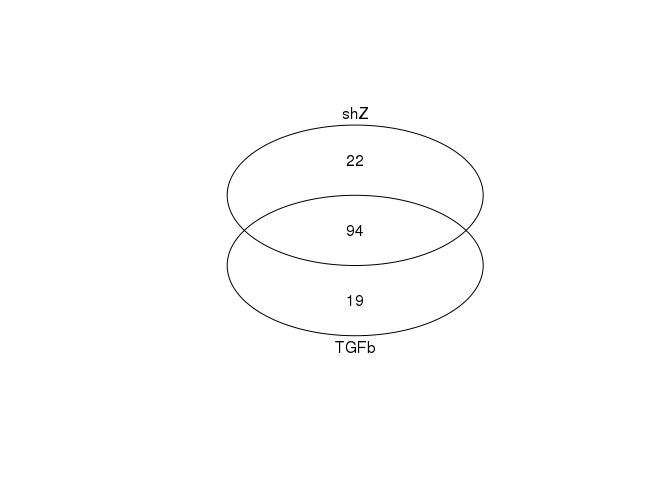
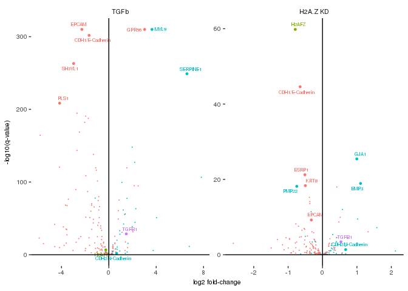
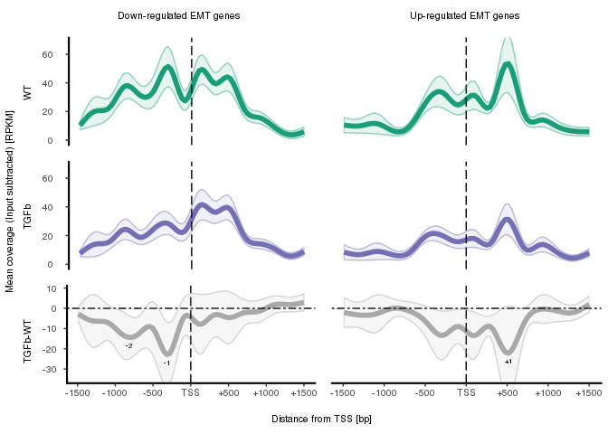
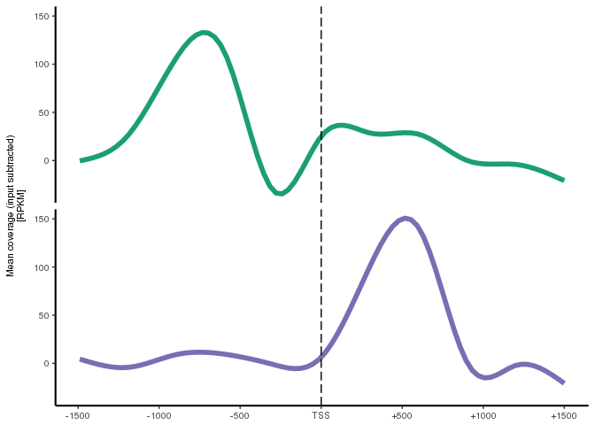

The histone variant H2A.Z: a master regulator of the epithelial-mesenchymal transition - Figures 2 & 3
================
Sebastian Kurscheid - <sebastian.kurscheid@anu.edu.au>

-   [Figure 2 - Gene expression data from RNA-Seq experiment.](#figure-2---gene-expression-data-from-rna-seq-experiment.)
    -   [Data preparation](#data-preparation)
    -   [Prepare data for plotting](#prepare-data-for-plotting)
    -   [Venn Diagrams (Figure 2 A & B)](#venn-diagrams-figure-2-a-b)
    -   [Volcano Plots (Figure 2 C & D)](#volcano-plots-figure-2-c-d)
-   [Figure 3 - H2A.Z occupancy from ChIP-Seq experiment and integrative analysis.](#figure-3---h2a.z-occupancy-from-chip-seq-experiment-and-integrative-analysis.)
    -   [Data preparation](#data-preparation-1)
        -   [Load the coverage data generated by deepTools computeMatrix command](#load-the-coverage-data-generated-by-deeptools-computematrix-command)
        -   [Data formatting](#data-formatting)
        -   [Calculate difference data for the WT and TGF-beta data](#calculate-difference-data-for-the-wt-and-tgf-beta-data)
            -   [Set some parameters for plotting](#set-some-parameters-for-plotting)
        -   [Plotting](#plotting)
            -   [Figure 3 A & B](#figure-3-a-b)
            -   [Figure 3 C, D & E](#figure-3-c-d-e)
                -   [Data preparation](#data-preparation-2)
                -   [Plotting](#plotting-1)
                -   [Figure 3 F & G](#figure-3-f-g)

Load required libraries

``` r
require(readr)
require(jsonlite)
require(GenomicRanges)
require(data.table)
require(ggplot2)
require(deepToolsUtils)
require(ggrepel)
require(data.table)
require(VennDiagram)
require(zoo)
require(gridExtra)
require(gtools)
```

Data for analysis has been pre-processed using snakemake. The relevant workflow can be found \[here\] \#\# Todo: Insert link to github repo

Figure 2 - Gene expression data from RNA-Seq experiment.
========================================================

Data preparation
----------------

Load the pre-processed data, including output of kallisto/sleuth and the EMT marker genes defined by Tan et al.

``` r
baseDir <- "~/Data/Publications/MDCK_EMT_Paper"
setwd(baseDir)
load("data/RNA-Seq/resultsCompressed.rda")
load("data/cfamEnsGenesSigEMTCells.rda")
emtUp <- rtracklayer::import("data/Tan_et_al_EMT_up_genes.bed")
emtDown <- rtracklayer::import("data/Tan_et_al_EMT_down_genes.bed")
suppressWarnings(emtGenes <- c(emtUp, emtDown))
names(emtGenes) <- emtGenes$name
```

Extract the differential expression data for the two experiments.

``` r
deTGFbTab <- as.data.table(resultsCompressed[["MDCK"]]$sleuth_results.gene[["conditionMDCKTGFb"]])
deshZTab <- as.data.table(resultsCompressed[["MDCK"]]$sleuth_results.gene[["conditionMDCKshZ"]])
setkey(deshZTab, target_id)
setkey(deTGFbTab, target_id)
```

Load and re-format annotation data.

``` r
cfamEnsGenesSigEMTCells <- data.table(cfamEnsGenesSigEMTCells)
setkey(cfamEnsGenesSigEMTCells, ensembl_gene_id)
```

Prepare data for plotting
-------------------------

``` r
m1 <- merge(deTGFbTab[, c("target_id", "qval", "b", "pval")], cfamEnsGenesSigEMTCells[, 
    c("ensembl_gene_id", "external_gene_name", "epi_mes", "expression")], by.x = "target_id", 
    by.y = "ensembl_gene_id")
m1$experiment <- "TGFb"
m1$logqval <- -log10(m1$qval)
m1$logFC <- log2(exp(m1$b))

# have to manipulate data in order to deal with Inf when plotting
m1[which(m1$logqval == Inf), "logqval"] <- 310
m2 <- merge(deshZTab[, c("target_id", "qval", "b", "pval")], cfamEnsGenesSigEMTCells[, 
    c("ensembl_gene_id", "external_gene_name", "epi_mes", "expression")], by.x = "target_id", 
    by.y = "ensembl_gene_id")
m2$experiment <- "H2A.Z KD"
m2$logqval <- -log10(m2$qval)
m2$logFC <- log2(exp(m2$b))
table(m1$expression)
```

    ## 
    ## down   up 
    ##  113   79

``` r
setkey(m2, "target_id")
m2[deshZTab[m2$target_id][which(deshZTab[m2$target_id]$b > 0), ]$target_id, 
    "expression"] <- "up"
m2[deshZTab[m2$target_id][which(deshZTab[m2$target_id]$b < 0), ]$target_id, 
    "expression"] <- "down"

volcanoData <- rbind(m1, m2)
table(volcanoData$experiment, volcanoData$expression)
```

    ##           
    ##            down  up
    ##   H2A.Z KD  116  76
    ##   TGFb      113  79

``` r
volcanoData$experiment <- as.factor(volcanoData$experiment)
volcanoData$experiment <- relevel(volcanoData$experiment, "TGFb")
```

Venn Diagrams (Figure 2 A & B)
------------------------------

``` r
TGFbup <- volcanoData[volcanoData$experiment == "TGFb" & volcanoData$expression == 
    "up"]$target_id
TGFbdown <- volcanoData[volcanoData$experiment == "TGFb" & volcanoData$expression == 
    "down"]$target_id
shZup <- volcanoData[volcanoData$experiment == "H2A.Z KD" & volcanoData$expression == 
    "up"]$target_id
shZdown <- volcanoData[volcanoData$experiment == "H2A.Z KD" & volcanoData$expression == 
    "down"]$target_id
upList <- list(TGFb = TGFbup, shZ = shZup)
downList <- list(TGFb = TGFbdown, shZ = shZdown)
vennUp <- gplots::venn(upList, intersection = T)
```



``` r
vennDown <- gplots::venn(downList, intersections = T)
```



Volcano Plots (Figure 2 C & D)
------------------------------

``` r
# volcano plots
labelSize <- 2

p1 <- ggplot(volcanoData, aes(x = logFC, y = logqval, color = epi_mes)) + geom_point(size = 0.05) + 
    geom_point(data = subset(volcanoData, experiment == "TGFb" & logqval > 200), 
        aes(x = logFC, y = logqval, color = epi_mes), size = 1) + geom_text_repel(data = subset(volcanoData, 
    experiment == "TGFb" & logqval > 200), aes(x = logFC, y = logqval, label = external_gene_name), 
    show.legend = F, size = labelSize) + geom_point(data = subset(volcanoData, 
    experiment == "TGFb" & epi_mes %in% c("TGFB1", "H2A.Z")), aes(x = logFC, 
    y = logqval, color = epi_mes), size = 1) + geom_text_repel(data = subset(volcanoData, 
    experiment == "TGFb" & epi_mes %in% c("TGFB1", "H2A.Z")), aes(x = logFC, 
    y = logqval, label = external_gene_name), show.legend = F, size = labelSize) + 
    geom_point(data = volcanoData[grep("FN1|CDH2", volcanoData$external_gene_name)], 
        aes(x = logFC, y = logqval, color = epi_mes), size = 1) + geom_text_repel(data = volcanoData[grep("FN1|CDH2", 
    volcanoData$external_gene_name)], aes(x = logFC, y = logqval, label = external_gene_name), 
    show.legend = F, size = labelSize) + geom_point(data = subset(volcanoData, 
    experiment == "H2A.Z KD" & logqval > 18), aes(x = logFC, y = logqval, color = epi_mes), 
    size = 1) + geom_text_repel(data = subset(volcanoData, experiment == "H2A.Z KD" & 
    logqval > 18), aes(x = logFC, y = logqval, label = external_gene_name), 
    show.legend = F, size = labelSize) + geom_point(data = subset(volcanoData, 
    experiment == "H2A.Z KD" & epi_mes %in% c("TGFB1")), aes(x = logFC, y = logqval, 
    color = epi_mes), size = 1) + geom_text_repel(data = subset(volcanoData, 
    experiment == "H2A.Z KD" & epi_mes %in% c("TGFB1")), aes(x = logFC, y = logqval, 
    label = external_gene_name), show.legend = F, size = labelSize) + geom_point(data = subset(volcanoData, 
    experiment == "H2A.Z KD" & target_id == "ENSCAFG00000002653"), aes(x = logFC, 
    y = logqval, color = epi_mes), size = 1) + geom_text_repel(data = subset(volcanoData, 
    experiment == "H2A.Z KD" & target_id == "ENSCAFG00000002653"), aes(x = logFC, 
    y = logqval, label = external_gene_name), show.legend = F, size = labelSize) + 
    facet_wrap("experiment", scales = "free") + geom_hline(yintercept = 0) + 
    geom_vline(xintercept = 0) + theme(panel.background = element_blank(), panel.border = element_blank(), 
    panel.grid.major = element_blank(), panel.grid.minor = element_blank(), 
    strip.background = element_blank(), strip.text = element_text(size = 8), 
    axis.title.x = element_text(size = 8), axis.title.y = element_text(size = 8), 
    axis.text = element_text(size = 8), legend.text = element_text(size = 8), 
    legend.title = element_text(size = 8), legend.key.size = unit(c(0.5, 0.75), 
        units = "cm")) + xlab("log2 fold-change") + ylab("-log10(q-value)") + 
    labs(color = "Gene/Marker type") + scale_colour_hue(labels = c("Epithelial", 
    "H2A.Z", "Mesenchymal", "TGFB1"))
p1 <- p1 + theme(legend.position = "none")
p1
```

    ## Warning: Removed 2 rows containing missing values (geom_point).

    ## Warning: Removed 2 rows containing missing values (geom_point).

    ## Warning: Removed 2 rows containing missing values (geom_text_repel).



Figure 3 - H2A.Z occupancy from ChIP-Seq experiment and integrative analysis.
=============================================================================

Data preparation
----------------

``` r
ChIPdataDir <- paste(baseDir, "data", "ChIP-Seq", sep = "/")
list.files(ChIPdataDir)
```

    ## [1] "H2AZ-TGFb_vs_Input-TGFb_normal.readCount.subtract_RPKM_TanEMTdown_normal.matrix.gz"
    ## [2] "H2AZ-TGFb_vs_Input-TGFb_normal.readCount.subtract_RPKM_TanEMTup_normal.matrix.gz"  
    ## [3] "H2AZ-WT_vs_Input-WT_normal.readCount.subtract_RPKM_TanEMTdown_normal.matrix.gz"    
    ## [4] "H2AZ-WT_vs_Input-WT_normal.readCount.subtract_RPKM_TanEMTup_normal.matrix.gz"

### Load the coverage data generated by deepTools computeMatrix command

``` r
files <- list.files(ChIPdataDir, pattern = "Tan")
suppressWarnings(dataList <- lapply(paste(ChIPdataDir, files, sep = "/"), function(x) computeMatrixLoader(x)))
names(dataList) <- files
plotData <- lapply(dataList, function(x) deepToolsUtils::makePlottingData(x))
```

    ## [1] "H2AZ-TGFb_vs_Input-TGFb_normal_subtract_RPKM"
    ## [1] "H2AZ-TGFb_vs_Input-TGFb_normal_subtract_RPKM"

    ## Warning: closing unused connection 8 (~/Data/Publications/
    ## MDCK_EMT_Paper/data/ChIP-Seq/H2AZ-WT_vs_Input-
    ## WT_normal.readCount.subtract_RPKM_TanEMTup_normal.matrix.gz)

    ## Warning: closing unused connection 7 (~/Data/Publications/
    ## MDCK_EMT_Paper/data/ChIP-Seq/H2AZ-WT_vs_Input-
    ## WT_normal.readCount.subtract_RPKM_TanEMTdown_normal.matrix.gz)

    ## Warning: closing unused connection 6 (~/Data/Publications/
    ## MDCK_EMT_Paper/data/ChIP-Seq/H2AZ-TGFb_vs_Input-
    ## TGFb_normal.readCount.subtract_RPKM_TanEMTup_normal.matrix.gz)

    ## Warning: closing unused connection 5 (~/Data/Publications/
    ## MDCK_EMT_Paper/data/ChIP-Seq/H2AZ-TGFb_vs_Input-
    ## TGFb_normal.readCount.subtract_RPKM_TanEMTdown_normal.matrix.gz)

    ## [1] "H2AZ-WT_vs_Input-WT_normal_subtract_RPKM"
    ## [1] "H2AZ-WT_vs_Input-WT_normal_subtract_RPKM"

``` r
names(plotData) <- unlist(lapply(strsplit(files, "\\."), function(x) paste(x[c(1:3)], 
    collapse = ".")))
plotData <- lapply(names(plotData), function(x) {
    tab <- plotData[[x]]
    tab$geneset <- x
    return(tab)
})
```

### Data formatting

``` r
names(plotData) <- unlist(lapply(strsplit(files, "\\."), function(x) paste(x[c(1:3)], 
    collapse = ".")))
plotData <- do.call("rbind", plotData)
plotDataWT <- plotData[grep("WT", plotData$sample), ]
plotDataTGFb <- plotData[grep("TGFb", plotData$sample), ]
ylimMax <- max(plotData$value + (plotData$sem/2))
ylimMin <- min(plotData$value - plotData$sem)
```

### Calculate difference data for the WT and TGF-beta data

``` r
# make difference data by subtracting WT from TGFb
bin <- 1:300
diff1 <- data.frame(bin = bin, value = plotDataTGFb[plotDataTGFb$geneset == 
    "H2AZ-TGFb_vs_Input-TGFb_normal.readCount.subtract_RPKM_TanEMTdown_normal", 
    ]$value - plotDataWT[plotDataWT$geneset == "H2AZ-WT_vs_Input-WT_normal.readCount.subtract_RPKM_TanEMTdown_normal", 
    ]$value, sample = "TGFb - WT", group = "down_diff", geneset = "TanEMTdown", 
    sem = sqrt((plotDataTGFb[plotDataTGFb$geneset == "H2AZ-TGFb_vs_Input-TGFb_normal.readCount.subtract_RPKM_TanEMTdown_normal", 
        ]$sem)^2 + (plotDataWT[plotDataWT$geneset == "H2AZ-WT_vs_Input-WT_normal.readCount.subtract_RPKM_TanEMTdown_normal", 
        ]$sem)^2))
diff2 <- data.frame(bin = bin, value = plotDataTGFb[plotDataTGFb$geneset == 
    "H2AZ-TGFb_vs_Input-TGFb_normal.readCount.subtract_RPKM_TanEMTup_normal", 
    ]$value - plotDataWT[plotDataWT$geneset == "H2AZ-WT_vs_Input-WT_normal.readCount.subtract_RPKM_TanEMTup_normal", 
    ]$value, sample = "TGFb - WT", group = "down_diff", geneset = "TanEMTup", 
    sem = sqrt((plotDataTGFb[plotDataTGFb$geneset == "H2AZ-TGFb_vs_Input-TGFb_normal.readCount.subtract_RPKM_TanEMTup_normal", 
        ]$sem)^2 + (plotDataWT[plotDataWT$geneset == "H2AZ-WT_vs_Input-WT_normal.readCount.subtract_RPKM_TanEMTup_normal", 
        ]$sem)^2))
diffData <- as.data.table(rbind(diff1, diff2))
```

#### Set some parameters for plotting

``` r
diffylimMin <- min(diffData$value - (diffData$sem/2.3))
diffylimMax <- max(diffData$value + (diffData$sem/1.3))
lineSize <- 2
axisLineSize <- 0.75
vlineCol <- "black"
wtCol <- "#1b9e77"
TGFbCol <- "#7570b3"
diffCol <- "darkgrey"
nSplines <- 20
downXAxisMargin <- 3.6
axisTextSize <- 8
```

### Plotting

#### Figure 3 A & B

``` r
nBins <- nrow(plotDataWT[grep("down", plotDataWT$geneset), ])
wtPlotDown <- ggplot(plotDataWT[grep("down", plotDataWT$geneset), ], aes(bin, 
    value)) + geom_smooth(method = "lm", formula = y ~ splines::ns(x, nBins/nSplines), 
    se = F, col = wtCol, size = lineSize) + geom_smooth(aes(x = bin, y = value - 
    sem), method = "lm", formula = y ~ splines::ns(x, nBins/nSplines), se = F, 
    col = alpha(wtCol, 0.2), size = 0.5, fullrange = F) + geom_smooth(aes(x = bin, 
    y = value + sem), method = "lm", formula = y ~ splines::ns(x, nBins/nSplines), 
    se = F, col = alpha(wtCol, 0.2), size = 0.5, fullrange = F) + facet_wrap(c("geneset"), 
    ncol = 2, labeller = label_both) + ylab(NULL) + xlab(NULL) + geom_vline(xintercept = 150, 
    colour = vlineCol, linetype = "longdash") + coord_cartesian(ylim = c(0, 
    ylimMax)) + theme(axis.title.x = element_blank(), axis.text.x = element_blank(), 
    axis.ticks.x = element_blank(), axis.text.y = element_text(margin = margin(0, 
        downXAxisMargin, 0, 0, "mm"), size = axisTextSize), strip.background = element_blank(), 
    strip.text = element_blank(), axis.line.y = element_line(colour = "black", 
        axisLineSize), panel.background = element_blank(), panel.border = element_blank(), 
    panel.grid.major = element_blank(), panel.grid.minor = element_blank())
wtPlotDownData <- ggplot_build(wtPlotDown)
df1 <- data.frame(x = wtPlotDownData$data[[2]]$x, ymin = wtPlotDownData$data[[2]]$y, 
    ymax = wtPlotDownData$data[[3]]$y)
wtPlotDown <- wtPlotDown + geom_ribbon(data = df1, aes(x = x, ymin = ymin, ymax = ymax), 
    colour = alpha(wtCol, 0.3), alpha = 0.1, inherit.aes = F, fill = wtCol)


# plot 2 - WT up-regulated ------------------------------------------------
wtPlotUp <- ggplot(plotDataWT[grep("up", plotDataWT$geneset), ], aes(bin, value)) + 
    geom_smooth(method = "lm", formula = y ~ splines::ns(x, nBins/nSplines), 
        se = F, col = wtCol, size = lineSize) + geom_smooth(aes(x = bin, y = value - 
    sem), method = "lm", formula = y ~ splines::ns(x, nBins/nSplines), se = F, 
    col = alpha(wtCol, 0.2), size = 0.5, fullrange = F) + geom_smooth(aes(x = bin, 
    y = value + sem), method = "lm", formula = y ~ splines::ns(x, nBins/nSplines), 
    se = F, col = alpha(wtCol, 0.2), size = 0.5, fullrange = F) + ylab(NULL) + 
    xlab(NULL) + geom_vline(xintercept = 150, colour = vlineCol, linetype = "longdash") + 
    coord_cartesian(ylim = c(0, ylimMax)) + theme(axis.title.x = element_blank(), 
    axis.text.x = element_blank(), axis.ticks.x = element_blank(), axis.text.y = element_blank(), 
    axis.line.y = element_blank(), axis.ticks.y = element_blank(), strip.background = element_blank(), 
    strip.text = element_blank(), panel.background = element_blank(), panel.border = element_blank(), 
    panel.grid.major = element_blank(), panel.grid.minor = element_blank())
wtPlotUpData <- ggplot_build(wtPlotUp)
df1 <- data.frame(x = wtPlotUpData$data[[2]]$x, ymin = wtPlotUpData$data[[2]]$y, 
    ymax = wtPlotUpData$data[[3]]$y)
wtPlotUp <- wtPlotUp + geom_ribbon(data = df1, aes(x = x, ymin = ymin, ymax = ymax), 
    colour = alpha(wtCol, 0.3), alpha = 0.1, inherit.aes = F, fill = wtCol)


# plot 3 - TGFb down-regulated --------------------------------------------
TGFbPlotDown <- ggplot(plotDataTGFb[grep("down", plotDataTGFb$geneset), ], aes(bin, 
    value)) + geom_smooth(method = "lm", formula = y ~ splines::ns(x, nBins/nSplines), 
    se = F, col = TGFbCol, size = lineSize) + geom_smooth(aes(x = bin, y = value - 
    sem), method = "lm", formula = y ~ splines::ns(x, nBins/nSplines), se = F, 
    col = alpha(TGFbCol, 0.2), size = 0.5, fullrange = F) + geom_smooth(aes(x = bin, 
    y = value + sem), method = "lm", formula = y ~ splines::ns(x, nBins/nSplines), 
    se = F, col = alpha(TGFbCol, 0.2), size = 0.5, fullrange = F) + ylab(NULL) + 
    xlab(NULL) + geom_vline(xintercept = 150, colour = vlineCol, linetype = "longdash") + 
    coord_cartesian(ylim = c(0, ylimMax)) + theme(axis.title.x = element_blank(), 
    axis.text.x = element_blank(), axis.ticks.x = element_blank(), axis.text.y = element_text(margin = margin(0, 
        downXAxisMargin, 0, 0, "mm"), size = axisTextSize), strip.background = element_blank(), 
    strip.text = element_blank(), axis.line.y = element_line(colour = "black", 
        axisLineSize), panel.background = element_blank(), panel.border = element_blank(), 
    panel.grid.major = element_blank(), panel.grid.minor = element_blank())
TGFbPlotDownData <- ggplot_build(TGFbPlotDown)
df1 <- data.frame(x = TGFbPlotDownData$data[[2]]$x, ymin = TGFbPlotDownData$data[[2]]$y, 
    ymax = TGFbPlotDownData$data[[3]]$y)
TGFbPlotDown <- TGFbPlotDown + geom_ribbon(data = df1, aes(x = x, ymin = ymin, 
    ymax = ymax), colour = alpha(TGFbCol, 0.3), alpha = 0.1, inherit.aes = F, 
    fill = TGFbCol)


# plot 4 - TGFb up-regulated ----------------------------------------------
TGFbPlotUp <- ggplot(plotDataTGFb[grep("up", plotDataTGFb$geneset), ], aes(bin, 
    value)) + geom_smooth(method = "lm", formula = y ~ splines::ns(x, nBins/nSplines), 
    se = F, col = TGFbCol, size = lineSize) + geom_smooth(aes(x = bin, y = value - 
    sem), method = "lm", formula = y ~ splines::ns(x, nBins/nSplines), se = F, 
    col = alpha(TGFbCol, 0.2), size = 0.5, fullrange = F) + geom_smooth(aes(x = bin, 
    y = value + sem), method = "lm", formula = y ~ splines::ns(x, nBins/nSplines), 
    se = F, col = alpha(TGFbCol, 0.2), size = 0.5, fullrange = F) + ylab(NULL) + 
    xlab(NULL) + geom_vline(xintercept = 150, colour = vlineCol, linetype = "longdash") + 
    coord_cartesian(ylim = c(0, ylimMax)) + theme(axis.title.x = element_blank(), 
    axis.text.x = element_blank(), axis.ticks.x = element_blank(), axis.text.y = element_blank(), 
    axis.line.y = element_blank(), axis.ticks.y = element_blank(), strip.background = element_blank(), 
    strip.text = element_blank(), panel.background = element_blank(), panel.border = element_blank(), 
    panel.grid.major = element_blank(), panel.grid.minor = element_blank())
TGFbPlotUpData <- ggplot_build(TGFbPlotUp)
df1 <- data.frame(x = TGFbPlotUpData$data[[2]]$x, ymin = TGFbPlotUpData$data[[2]]$y, 
    ymax = TGFbPlotUpData$data[[3]]$y)
TGFbPlotUp <- TGFbPlotUp + geom_ribbon(data = df1, aes(x = x, ymin = ymin, ymax = ymax), 
    colour = alpha(TGFbCol, 0.3), alpha = 0.1, inherit.aes = F, fill = TGFbCol)


# plot 5 - diff down-regulated --------------------------------------------
annotationSize <- 2
diffPlotDown <- ggplot(diffData[grep("down", diffData$geneset), ], aes(bin, 
    value)) + geom_smooth(method = "lm", formula = y ~ splines::ns(x, nBins/nSplines), 
    se = F, col = diffCol, size = lineSize) + geom_smooth(aes(x = bin, y = value - 
    sem), method = "lm", formula = y ~ splines::ns(x, nBins/nSplines), se = F, 
    col = alpha(diffCol, 0.2), size = 0.5, fullrange = F) + geom_smooth(aes(x = bin, 
    y = value + sem), method = "lm", formula = y ~ splines::ns(x, nBins/nSplines), 
    se = F, col = alpha(diffCol, 0.2), size = 0.5, fullrange = F) + ylab(NULL) + 
    xlab(NULL) + geom_text_repel(data = subset(diffData, geneset == "TanEMTdown")[118], 
    aes(x = bin, y = value, label = "-1"), size = annotationSize, nudge_y = -1) + 
    geom_text_repel(data = subset(diffData, geneset == "TanEMTdown")[68], aes(x = bin, 
        y = value, label = "-2"), size = annotationSize, nudge_y = -1) + geom_vline(xintercept = 150, 
    colour = vlineCol, linetype = "longdash") + geom_hline(yintercept = 0, linetype = "twodash") + 
    coord_cartesian(ylim = c(diffylimMax, diffylimMin)) + scale_x_continuous(breaks = c(0, 
    50, 100, 150, 200, 250, 300), labels = c("-1500", "-1000", "-500", "TSS", 
    "+500", "+1000", "+1500")) + theme(axis.line.x = element_line(colour = "black", 
    axisLineSize), axis.text.x = element_text(size = axisTextSize), axis.text.y = element_text(margin = margin(0, 
    2, 0, 0, "mm"), size = axisTextSize), strip.background = element_blank(), 
    strip.text = element_blank(), axis.line.y = element_line(colour = "black", 
        axisLineSize), panel.background = element_blank(), panel.border = element_blank(), 
    panel.grid.major = element_blank(), panel.grid.minor = element_blank())
diffPlotDownData <- ggplot_build(diffPlotDown)
df1 <- data.frame(x = diffPlotDownData$data[[2]]$x, ymin = diffPlotDownData$data[[2]]$y, 
    ymax = diffPlotDownData$data[[3]]$y)
diffPlotDown <- diffPlotDown + geom_ribbon(data = df1, aes(x = x, ymin = ymin, 
    ymax = ymax), colour = alpha(diffCol, 0.3), alpha = 0.1, inherit.aes = F, 
    fill = diffCol)

# plot 6 - diff up-regulated --------------------------------------------
diffPlotUp <- ggplot(diffData[grep("up", diffData$geneset), ], aes(bin, value)) + 
    geom_smooth(method = "lm", formula = y ~ splines::ns(x, nBins/nSplines), 
        se = F, col = diffCol, size = lineSize) + geom_smooth(aes(x = bin, y = value - 
    sem), method = "lm", formula = y ~ splines::ns(x, nBins/nSplines), se = F, 
    col = alpha(diffCol, 0.2), size = 0.5, fullrange = F) + geom_smooth(aes(x = bin, 
    y = value + sem), method = "lm", formula = y ~ splines::ns(x, nBins/nSplines), 
    se = F, col = alpha(diffCol, 0.2), size = 0.5, fullrange = F) + ylab(NULL) + 
    xlab(NULL) + geom_text_repel(data = subset(diffData, geneset == "TanEMTup")[202], 
    aes(x = bin, y = value, label = "+1"), size = annotationSize, nudge_y = -1) + 
    geom_vline(xintercept = 150, colour = vlineCol, linetype = "longdash") + 
    geom_hline(yintercept = 0, linetype = "twodash") + scale_x_continuous(breaks = c(0, 
    50, 100, 150, 200, 250, 300), labels = c("-1500", "-1000", "-500", "TSS", 
    "+500", "+1000", "+1500")) + coord_cartesian(ylim = c(diffylimMax, diffylimMin)) + 
    theme(axis.text.y = element_blank(), axis.line.y = element_blank(), axis.ticks.y = element_blank(), 
        axis.line.x = element_line(colour = "black", axisLineSize), axis.text.x = element_text(size = axisTextSize), 
        strip.background = element_blank(), strip.text = element_blank(), panel.background = element_blank(), 
        panel.border = element_blank(), panel.grid.major = element_blank(), 
        panel.grid.minor = element_blank())
diffPlotUpData <- ggplot_build(diffPlotUp)
df1 <- data.frame(x = diffPlotUpData$data[[2]]$x, ymin = diffPlotUpData$data[[2]]$y, 
    ymax = diffPlotUpData$data[[3]]$y)
diffPlotUp <- diffPlotUp + geom_ribbon(data = df1, aes(x = x, ymin = ymin, ymax = ymax), 
    colour = alpha(diffCol, 0.3), alpha = 0.1, inherit.aes = F, fill = diffCol)

# prepare layout grid for panels
lay <- rbind(c(1, 2, 3, 4), c(1, 5, 6, 7), c(1, 8, 9, 10), c(1, 11, 12, 13), 
    c(14, 14, 15, 15))

gpFontSize <- gpar(fontsize = 8)
xAx <- grid::textGrob("Distance from TSS [bp]", gp = gpFontSize)
yAx <- grid::textGrob("Mean coverage (Input subtracted) [RPKM]", rot = 90, gp = gpFontSize)
topX1 <- grid::textGrob("Down-regulated EMT genes", gp = gpFontSize)
topX2 <- grid::textGrob("Up-regulated EMT genes", gp = gpFontSize)
wtLabel <- grid::textGrob("WT", rot = 90, gp = gpFontSize)
tgfbLabel <- grid::textGrob("TGFb", rot = 90, gp = gpFontSize)
diffLabel <- grid::textGrob("TGFb-WT", rot = 90, gp = gpFontSize)
emptyBox <- grid::rectGrob(gp = grid::gpar(fill = "white", lty = 0))

gs <- list(yAx, emptyBox, topX1, topX2, wtLabel, wtPlotDown, wtPlotUp, tgfbLabel, 
    TGFbPlotDown, TGFbPlotUp, diffLabel, diffPlotDown, diffPlotUp, emptyBox, 
    xAx)
grob1 <- gridExtra::grid.arrange(grobs = gs, layout_matrix = lay, widths = c(0.5, 
    0.5, 8, 8), heights = c(1, 4, 4, 4, 1))
```



#### Figure 3 C, D & E

##### Data preparation

``` r
g_legend <- function(a.gplot) {
    tmp <- ggplot_gtable(ggplot_build(a.gplot))
    leg <- which(sapply(tmp$grobs, function(x) x$name) == "guide-box")
    legend <- tmp$grobs[[leg]]
    legend
}

cmTGFbUp <- dataList[["H2AZ-TGFb_vs_Input-TGFb_normal.readCount.subtract_RPKM_TanEMTup_normal.matrix.gz"]]$computeMatrix
cmWTUp <- dataList[["H2AZ-WT_vs_Input-WT_normal.readCount.subtract_RPKM_TanEMTup_normal.matrix.gz"]]$computeMatrix
diffUp <- cmTGFbUp[, 2:301] - cmWTUp[, 2:301]
rownames(diffUp) <- cmTGFbUp$X4

cmTGFbDown <- dataList[["H2AZ-TGFb_vs_Input-TGFb_normal.readCount.subtract_RPKM_TanEMTdown_normal.matrix.gz"]]$computeMatrix
cmWTDown <- dataList[["H2AZ-WT_vs_Input-WT_normal.readCount.subtract_RPKM_TanEMTdown_normal.matrix.gz"]]$computeMatrix
diffDown <- cmTGFbDown[, 2:301] - cmWTDown[, 2:301]
rownames(diffDown) <- diffDown$X4
cmWT <- rbind(cmWTDown, cmWTUp)
cmTGFb <- rbind(cmTGFbDown, cmTGFbUp)

diffUp <- as.data.table(diffUp)
diffUp$geneID <- cmTGFbUp$X4
datUp <- melt(diffUp, id.vars = "geneID", measure.vars <- c(1:300))
datUp <- datUp[order(datUp$geneID), ]
setkey(datUp, "geneID")

diffDown <- data.table(diffDown)
diffDown$geneID <- cmTGFbDown$X4
datDown <- melt(diffDown, id.vars = "geneID", measure.vars <- c(1:300))
datDown <- datDown[order(datDown$geneID), ]
setkey(datDown, "geneID")

cols <- c("#ca0020", "#f7f7f7", "#0571b0")

rollWidth <- 10
rollBy <- 5

datDownSum <- lapply(unique(datDown$geneID), function(x) {
    n <- rollapply(datDown[x]$value, width = rollWidth, by = rollBy, FUN = mean)
    df <- data.frame(geneID = x, bin = 1:length(n), value = n)
    return(df)
})
datDownSum <- as.data.table(as.data.frame(do.call("rbind", datDownSum)))
datDownSum$cat <- gtools::quantcut(datDownSum$value, q = 3)
levels(datDownSum$cat) <- c("loss", "no change", "gain")

datUpSum <- lapply(unique(datUp$geneID), function(x) {
    n <- rollapply(datUp[x]$value, width = rollWidth, by = rollBy, FUN = mean)
    df <- data.frame(geneID = x, bin = 1:length(n), value = n)
    return(df)
})
datUpSum <- as.data.table(as.data.frame(do.call("rbind", datUpSum)))
datUpSum$cat <- quantcut(datUpSum$value, q = 3)
levels(datUpSum$cat) <- c("loss", "no change", "gain")

TGFbUpb2 <- deTGFbTab[cmTGFbUp$X4][deTGFbTab[cmTGFbUp$X4]$b > 0]$target_id
TGFbDownb2 <- deTGFbTab[cmTGFbDown$X4][deTGFbTab[cmTGFbDown$X4]$b < 0]$target_id
minDiff <- 15

datSum <- rbind(datDownSum, datUpSum)
colnames(datSum)[1] <- "ensembl_gene_id"
setkey(datSum, ensembl_gene_id, bin)
datSum <- datSum[order(datSum$ensembl_gene_id, datSum$bin)]
diffExp <- subset(deTGFbTab, target_id %in% c(TGFbDownb2, TGFbUpb2))
diffExp <- diffExp[order(diffExp$target_id)]
diffExp$logFC <- log2(exp(diffExp$b))
diffH2AZDEcor <- lapply(1:max(datDownSum$bin), function(x) {
    allDat <- merge(subset(datSum, bin == x), diffExp, by.x = "ensembl_gene_id", 
        by.y = "target_id")
    allDat <- merge(allDat, cfamEnsGenesSigEMTCells[, c("ensembl_gene_id", "external_gene_name", 
        "epi_mes")], all.x = T)
    abLine <- coef(lm(b ~ value, data = allDat))
    allPlot <- ggplot(allDat, aes(x = value, y = b)) + geom_point() + geom_abline(slope = abLine[2], 
        intercept = abLine[1], colour = "darkgrey", size = 1, linetype = "longdash")
    allCor1 <- suppressWarnings(cor.test(allDat$value, allDat$b, method = "spearman"))
    allCor2 <- suppressWarnings(cor.test(allDat[which(abs(allDat$value) > minDiff), 
        ]$value, allDat[which(abs(allDat$value) > minDiff), ]$b, method = "spearman"))
    return(list(all1 = allCor1, all2 = allCor2, allPlot = allPlot, allDat = allDat))
})

allCor <- lapply(diffH2AZDEcor, function(x) {
    data.frame(x$all1$p.value, x$all1$estimate, x$all2$p.value, x$all2$estimate)
})
allCor <- do.call("rbind", allCor)
allCor$bin <- 1:nrow(allCor)
save(allCor, file = "allCor.rda")
minCor1 <- which.min(allCor$x.all1.estimate)
allCor[which.min(allCor$x.all1.estimate), ]
```

    ##       x.all1.p.value x.all1.estimate x.all2.p.value x.all2.estimate bin
    ## rho50     0.01326705      -0.1784557      0.3399112      -0.1487466  51

``` r
maxCor1 <- which.max(allCor$x.all1.estimate)
allCor[which.max(allCor$x.all1.estimate), ]
```

    ##       x.all1.p.value x.all1.estimate x.all2.p.value x.all2.estimate bin
    ## rho15     0.02251229       0.1646112      0.0295237       0.3750955  16

``` r
minCor2 <- which.min(allCor$x.all2.estimate)
allCor[which.min(allCor$x.all2.estimate), ]
```

    ##       x.all1.p.value x.all1.estimate x.all2.p.value x.all2.estimate bin
    ## rho40     0.02451926      -0.1622823    0.006332314      -0.3419259  41

``` r
maxCor2 <- which.max(allCor$x.all2.estimate)
allCor[which.max(allCor$x.all2.estimate), ]
```

    ##       x.all1.p.value x.all1.estimate x.all2.p.value x.all2.estimate bin
    ## rho13     0.09846072       0.1196015    0.001089065       0.4861069  14

##### Plotting

``` r
# plot of Spearman correlation between differential expression and --------
# with genes that have min. +/- 10 H2A.Z difference in a given bin
corPlot2 <- ggplot(allCor, aes(bin, x.all2.estimate)) + geom_line(col = "darkgrey", 
    size = lineSize) + scale_x_continuous(breaks = c(0, 10, 20, 30, 40, 50, 
    60), labels = c("-1500", "-1000", "-500", "TSS", "+500", "+1000", "+1500")) + 
    geom_text_repel(data = allCor[c(maxCor2, minCor2), ], aes(x = bin, y = x.all2.estimate, 
        label = c("-2", "+1")), nudge_y = c(-0.15, +0.1), size = 3) + geom_point(data = allCor[c(maxCor2, 
    minCor2), ], aes(x = bin, y = x.all2.estimate), colour = "red") + geom_hline(yintercept = 0, 
    linetype = "twodash") + theme(panel.background = element_blank(), panel.grid.major = element_blank(), 
    panel.grid.minor = element_blank(), axis.line = element_line(colour = "black", 
        axisLineSize)) + xlab(NULL) + ylab(NULL) + geom_vline(xintercept = 30, 
    colour = vlineCol, linetype = "longdash")


datMax <- diffH2AZDEcor[[maxCor2]]$allDat
datMin <- diffH2AZDEcor[[minCor2]]$allDat
abLineMax <- coef(lm(b ~ value, data = datMax))
abLineMin <- coef(lm(b ~ value, data = datMin))

plotMax <- ggplot(datMax, aes(x = value, y = logFC)) + geom_point(aes(colour = epi_mes), 
    size = 0.05) + geom_abline(slope = coef(lm(logFC ~ value, data = datMax))[2], 
    intercept = coef(lm(logFC ~ value, data = datMax))[1], colour = "darkgrey", 
    size = 0.6, linetype = "longdash") + geom_point(data = subset(datMax, value < 
    -200 | abs(logFC) > 3), aes(x = value, y = logFC, colour = epi_mes), size = 1) + 
    geom_text_repel(data = subset(datMax, value < -200 | abs(logFC) > 3), aes(x = value, 
        y = logFC, label = external_gene_name, colour = epi_mes), show.legend = F, 
        size = 2) + ylab(NULL) + xlab(NULL) + labs(color = "Gene/Marker type") + 
    scale_colour_hue(labels = c("Epithelial", "H2A.Z", "Mesenchymal", "TGFB1")) + 
    theme(legend.position = "none", panel.background = element_blank(), panel.grid.major = element_blank(), 
        panel.grid.minor = element_blank(), axis.line = element_line(colour = "black", 
            axisLineSize), axis.text.y = element_text(margin = margin(0, 3, 
            0, 0, "mm")))

plotMin <- ggplot(datMin, aes(x = value, y = logFC)) + geom_point(aes(colour = epi_mes), 
    size = 0.05) + geom_abline(slope = coef(lm(logFC ~ value, data = datMin))[2], 
    intercept = coef(lm(logFC ~ value, data = datMin))[1], colour = "darkgrey", 
    size = 0.6, linetype = "longdash") + geom_point(data = subset(datMin, value < 
    -200 | abs(logFC) > 3), aes(x = value, y = logFC, colour = epi_mes), size = 1) + 
    geom_text_repel(data = subset(datMin, value < -200 | abs(logFC) > 3), aes(x = value, 
        y = logFC, label = external_gene_name, colour = epi_mes), show.legend = F, 
        size = 2) + ylab(NULL) + xlab(NULL) + labs(color = "Gene/Marker type") + 
    scale_colour_hue(labels = c("Epithelial", "H2A.Z", "Mesenchymal", "TGFB1")) + 
    theme(legend.position = "none", axis.text.y = element_blank(), panel.background = element_blank(), 
        panel.grid.major = element_blank(), panel.grid.minor = element_blank(), 
        legend.background = element_rect(fill = NA), axis.line = element_line(colour = "black", 
            axisLineSize))
# plotting ----------------------------------------------------------------
gpFontSize <- gpar(fontsize = 8)
xAx1 <- grid::textGrob("Distance from TSS [bp]", gp = gpFontSize)
xAx2 <- grid::textGrob("TFGb-WT [RPKM]", gp = gpFontSize)
yAx1 <- grid::textGrob("Spearman\n[rho-statistic]", rot = 90, gp = gpFontSize)
yAx2 <- grid::textGrob("Log2 fold-change\n[estimated]", rot = 90, gp = gpFontSize)
emptyBox <- grid::rectGrob(gp = grid::gpar(fill = "white", lty = 0))

lay <- rbind(c(1, 2, 2), c(3, 4, 4), c(5, 6, 7), c(8, 9, 9))
# remove legend as we can recycle legend from Figure 2 (assemble in
# Illustrator
gs <- list(yAx1, corPlot2, emptyBox, xAx1, yAx2, plotMax, plotMin, emptyBox, 
    xAx2)
grob2 <- gridExtra::grid.arrange(grobs = gs, layout_matrix = lay, widths = c(1, 
    10, 10), heights = c(2.5, 0.5, 7.5, 0.5))
```


##### Figure 3 F & G

``` r
# coverage plot for TGFB1
m1 <- melt(dataList[["H2AZ-TGFb_vs_Input-TGFb_normal.readCount.subtract_RPKM_TanEMTup_normal.matrix.gz"]]$computeMatrix[grep("ENSCAFG00000005014", 
    dataList[["H2AZ-TGFb_vs_Input-TGFb_normal.readCount.subtract_RPKM_TanEMTup_normal.matrix.gz"]]$computeMatrix$X4), 
    ])
```

    ## Using X4 as id variables

``` r
m2 <- melt(dataList[["H2AZ-WT_vs_Input-WT_normal.readCount.subtract_RPKM_TanEMTup_normal.matrix.gz"]]$computeMatrix[grep("ENSCAFG00000005014", 
    dataList[["H2AZ-WT_vs_Input-WT_normal.readCount.subtract_RPKM_TanEMTup_normal.matrix.gz"]]$computeMatrix$X4), 
    ])
```

    ## Using X4 as id variables

``` r
m3 <- melt(dataList[["H2AZ-TGFb_vs_Input-TGFb_normal.readCount.subtract_RPKM_TanEMTdown_normal.matrix.gz"]]$computeMatrix[grep("ENSCAFG00000002653", 
    dataList[["H2AZ-TGFb_vs_Input-TGFb_normal.readCount.subtract_RPKM_TanEMTdown_normal.matrix.gz"]]$computeMatrix$X4), 
    ])
```

    ## Using X4 as id variables

``` r
m3$set <- "TGFb"
m4 <- melt(dataList[["H2AZ-WT_vs_Input-WT_normal.readCount.subtract_RPKM_TanEMTdown_normal.matrix.gz"]]$computeMatrix[grep("ENSCAFG00000002653", 
    dataList[["H2AZ-WT_vs_Input-WT_normal.readCount.subtract_RPKM_TanEMTdown_normal.matrix.gz"]]$computeMatrix$X4), 
    ])
```

    ## Using X4 as id variables

``` r
m4$set <- "WT"
m3 <- rbind(m3, m4)
m3$bin <- rep(1:300, 2)
m3$set <- as.factor(m3$set)
m3$set <- relevel(m3$set, ref = "WT")
m3$gene <- "EPCAM"

m1$set <- "TGFb"
m1$bin <- 1:300
m2$set <- "WT"
m2$bin <- 1:300
m1 <- rbind(m1, m2)
m1$gene <- "TGFB1"
m1$set <- as.factor(m1$set)
m1$set <- relevel(m1$set, ref = "WT")

plotTGFb <- ggplot(m1, aes(bin, value, colour = set)) + geom_smooth(method = "lm", 
    formula = y ~ splines::ns(x, 10), se = F, size = lineSize) + facet_wrap(c("set"), 
    nrow = 2) + ylab(NULL) + xlab(NULL) + geom_vline(xintercept = 150, colour = vlineCol, 
    linetype = "longdash") + scale_x_continuous(breaks = c(0, 50, 100, 150, 
    200, 250, 300), labels = c("-1500", "-1000", "-500", "TSS", "+500", "+1000", 
    "+1500")) + labs(color = "Sample") + theme(axis.line = element_line(colour = "black", 
    size = axisLineSize), axis.text = element_text(size = 8), strip.background = element_blank(), 
    strip.text = element_blank(), panel.background = element_blank(), panel.border = element_blank(), 
    panel.grid.major = element_blank(), panel.grid.minor = element_blank(), 
    legend.position = "none") + scale_colour_manual(values = c(wtCol, TGFbCol))
plotTGFb
```


``` r
# coverage plot for EPCAM ENSCAFG00000002653
# -------------------------------------------------
plotEPCAM <- ggplot(m3, aes(bin, value, colour = set)) + geom_smooth(method = "lm", 
    formula = y ~ splines::ns(x, 10), se = F, size = lineSize) + facet_wrap(c("set"), 
    nrow = 2) + ylab("Mean coverage (input subtracted)\n[RPKM]") + xlab(NULL) + 
    labs(color = "Sample") + geom_vline(xintercept = 150, colour = vlineCol, 
    linetype = "longdash") + scale_x_continuous(breaks = c(0, 50, 100, 150, 
    200, 250, 300), labels = c("-1500", "-1000", "-500", "TSS", "+500", "+1000", 
    "+1500")) + theme(axis.line = element_line(colour = "black", size = axisLineSize), 
    axis.text = element_text(size = 8), axis.title = element_text(size = 8), 
    strip.background = element_blank(), strip.text = element_blank(), panel.background = element_blank(), 
    panel.border = element_blank(), panel.grid.major = element_blank(), panel.grid.minor = element_blank()) + 
    scale_colour_manual(values = c(wtCol, TGFbCol))
legendPlot <- g_legend(plotEPCAM)
plotEPCAM + theme(legend.position = "none")
```


